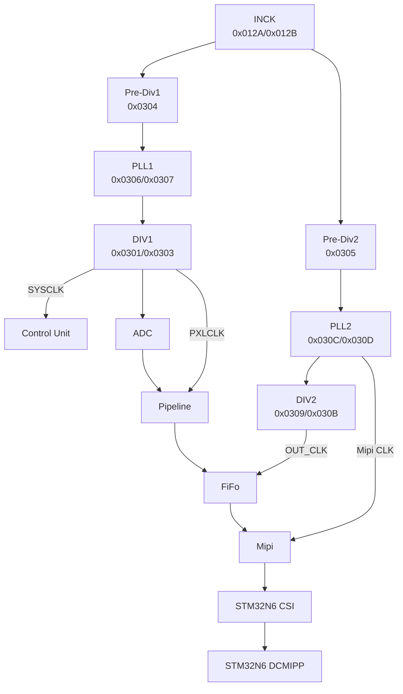

# NUCLEO-N657X0Q-Camera-Report 

## IMX219 Driver

### imx219_reg

File `imx219_reg.h` và `imx219_reg.c` chứa các hàm thực hiện việc ghi và đọc các thanh ghi, nhằm cấu hình cho IMX219.

Context của driver là `IMX219_CTX_t`, struct này gồm 3 thành phần:

- `void *handle` là con trỏ đến đối tượng phần cứng thực hiện
- `int32_t (*ReadReg)` là con trỏ hàm trỏ tới hàm đọc thanh ghi
- `int32_t (*WriteReg)` là con trỏ hàm trỏ tới hàm ghi thanh ghi

Các hàm `IMX219_ReadReg()`, `IMX219_WriteReg()` có tham số đầu vào là giá trị địa chỉ thanh ghi `reg`, nội dung  `data` (8 bit), `length` số lượng data 8 bit (số byte) ghi/đọc, và `ctx` context của driver. Đây là các wrapper.

### imx219_port

File `imx219_port.h` và `imx219_port.c` chứa hàm thực thi cụ thể việc đọc và ghi các thanh ghi thông qua giao thức I2C của STM32.

### imx219

Header `imx219.h` chứa các macro như địa chỉ I2C của IMX219, các thanh ghi cần cho việc cấu hình IMX219 theo Datasheet, đồng thời chứa các hàm phục vụ cấu hình và làm việc với sensor.

- `int32_t IMX219_Init()` khởi tạo sensor 
- `int32_t IMX219_Start()` khởi chạy
- `int32_t IMX219_Stop()` dừng
- `int32_t IMX219_ReadID()` để đọc ID I2C của sensor

Struct `IMX219_Reg_t` gồm `address` và `value`, cùng với hàm `IMX219_WriteTable` giúp ghi nhanh các giá trị vào thanh ghi để cấu hình.

File `imx219.c` thực hiện việc cấu hình các thanh ghi và triển khai các hàm chức năng. Tham khảo từ [IMX219 Driver for Linux Kernel](https://android.googlesource.com/kernel/common/%2B/refs/tags/android15-6.6-2024-11_r15/drivers/media/i2c/imx219.c), [SONY - IMX219PQH5-C Datasheet](https://www.opensourceinstruments.com/Electronics/Data/IMX219PQ.pdf)

## CLOCK SYSTEM

Tham khảo thêm từ [ AN6211 - Digital camera interface pixel pipeline description](https://www.st.com/resource/en/application_note/an6211-introduction-to-digital-camera-interface-pixel-pipeline-for-stm32-mcus-stmicroelectronics.pdf)


## AXI RAM
- Theo data flow của PIPE, data sẽ được ghi vào vùng AXISRAM. Ở đây ta chọn địa chỉ của vùng AXISRAM là `0x34200000` (vùng AXISRAM2). Trong hàm `HAL_DCMIPP_MspInit` của file `stm32n6xx_hal_msp.c`, ta thêm đoạn code sau để kích hoạt vùng Ram này:
```c
    /* USER CODE BEGIN DCMIPP_MspInit 1 */
	__HAL_RCC_AXISRAM2_MEM_CLK_ENABLE();
	__HAL_RCC_AXISRAM3_MEM_CLK_ENABLE();
	__HAL_RCC_AXISRAM4_MEM_CLK_ENABLE();
	__HAL_RCC_AXISRAM5_MEM_CLK_ENABLE();
	__HAL_RCC_AXISRAM6_MEM_CLK_ENABLE();
	RAMCFG_SRAM2_AXI->CR &= ~RAMCFG_CR_SRAMSD;
	RAMCFG_SRAM3_AXI->CR &= ~RAMCFG_CR_SRAMSD;
	RAMCFG_SRAM4_AXI->CR &= ~RAMCFG_CR_SRAMSD;
	RAMCFG_SRAM5_AXI->CR &= ~RAMCFG_CR_SRAMSD;
	RAMCFG_SRAM6_AXI->CR &= ~RAMCFG_CR_SRAMSD;
    /* USER CODE END DCMIPP_MspInit 1 */
```
## IRQ DEBUG

- Thêm các hàm đếm ngắt trong `DCMIPP_IRQHandler` và `CSI_IRQHandler` (trong file `stm32n6xx_it.c`) để debug cho đường truyền CSI và phần cứng DCMIPP trong quá trình nhận frame

```c
void DCMIPP_IRQHandler(void)
{
  /* USER CODE BEGIN DCMIPP_IRQn 0 */
    dcmipp_irq_count++;
  /* USER CODE END DCMIPP_IRQn 0 */
  HAL_DCMIPP_IRQHandler(&hdcmipp);
  /* USER CODE BEGIN DCMIPP_IRQn 1 */

  /* USER CODE END DCMIPP_IRQn 1 */
}
```

```c
void CSI_IRQHandler(void)
{
  /* USER CODE BEGIN CSI_IRQn 0 */
    uint32_t sr1;

    csi_irq_count++;

    sr1 = CSI->SR1;

    if (sr1 & (1UL << 1))
    {
        sot_lane0_count++;
    }

    if (sr1 & (1UL << 9))
    {
        sot_lane1_count++;
    }
  /* USER CODE END CSI_IRQn 0 */
  HAL_DCMIPP_CSI_IRQHandler(&hdcmipp);
  /* USER CODE BEGIN CSI_IRQn 1 */

  /* USER CODE END CSI_IRQn 1 */
}
```

## PIPE0 - RAW8
- Github: https://github.com/tintran193/NUCLEO-N65X0Q-Camera
- Điều chỉnh hàm `MX_DCMIPP_Init` trong `main.c` như sau:
```c
static void MX_DCMIPP_Init(void)
{

  /* USER CODE BEGIN DCMIPP_Init 0 */

  /* USER CODE END DCMIPP_Init 0 */

  DCMIPP_CSI_PIPE_ConfTypeDef pCSI_PipeConfig = {0};
  DCMIPP_CSI_ConfTypeDef pCSI_Config = {0};
  DCMIPP_PipeConfTypeDef pPipeConfig = {0};

  /* USER CODE BEGIN DCMIPP_Init 1 */

  /* USER CODE END DCMIPP_Init 1 */
  hdcmipp.Instance = DCMIPP;
  if (HAL_DCMIPP_Init(&hdcmipp) != HAL_OK)
  {
    Error_Handler();
  }

  /** Pipe 1 Config
  */
  pCSI_PipeConfig.DataTypeMode = DCMIPP_DTMODE_DTIDA;
  pCSI_PipeConfig.DataTypeIDA = DCMIPP_DT_RAW8;
  pCSI_PipeConfig.DataTypeIDB = DCMIPP_DT_RAW8;
  if (HAL_DCMIPP_CSI_PIPE_SetConfig(&hdcmipp, DCMIPP_PIPE0, &pCSI_PipeConfig) != HAL_OK)
  {
    Error_Handler();
  }
  pCSI_Config.PHYBitrate = DCMIPP_CSI_PHY_BT_450;
  pCSI_Config.DataLaneMapping = DCMIPP_CSI_PHYSICAL_DATA_LANES;
  pCSI_Config.NumberOfLanes = DCMIPP_CSI_TWO_DATA_LANES;
  HAL_DCMIPP_CSI_SetConfig(&hdcmipp, &pCSI_Config);
  pPipeConfig.FrameRate = DCMIPP_FRAME_RATE_ALL;
  pPipeConfig.PixelPipePitch = 640;
  pPipeConfig.PixelPackerFormat = DCMIPP_PIXEL_PACKER_FORMAT_MONO_Y8_G8_1;
  if (HAL_DCMIPP_PIPE_SetConfig(&hdcmipp, DCMIPP_PIPE0, &pPipeConfig) != HAL_OK)
  {
    Error_Handler();
  }
  if (HAL_DCMIPP_CSI_SetVCConfig(&hdcmipp, 0U, DCMIPP_CSI_DT_BPP8) != HAL_OK)
  {
    Error_Handler();
  }
  /* USER CODE BEGIN DCMIPP_Init 2 */

  /* USER CODE END DCMIPP_Init 2 */

}
```
- Khi `DCMIPP_CSI_PHY_BT_450` thì cấu hình tương ứng trong `imx219.c`là
```c
    {0x030D,0x39}
```
- Ở cấu hình Raw8 `DCMIPP_DT_RAW8`, cấu hình tương ứng trong `imx219.c` là
```   c
    {IMX219_REG_CSI_FORMAT_MSB,0x08},
    {IMX219_REG_CSI_FORMAT_LSB,0x08},
	{0x0309,0x08}
```
- Cấu hình `DCMIPP_CSI_DT_BPP8` vì ở Raw8, có 8 bit trong 1 pixel.
- Output in ra như sau (khi được chiếu sáng trực tiếp):
```
Serial port COM9 opened
IMX219_ReadID status = 0
IMX219 ID = 0x0219
Write OK: REG=0x0100 DATA=0x00
Read OK: REG=0x0100 DATA=0x00
IMX219: reading ID
IMX219 ID = 0x0219
IMX219: configuring 640x480 RAW10
WRITE REG=0x0100 DATA=0x00
WRITE REG=0x30EB DATA=0x05
WRITE REG=0x30EB DATA=0x0C
WRITE REG=0x300A DATA=0xFF
WRITE REG=0x300B DATA=0xFF
WRITE REG=0x30EB DATA=0x05
WRITE REG=0x30EB DATA=0x09
WRITE REG=0x0301 DATA=0x05
WRITE REG=0x0303 DATA=0x01
WRITE REG=0x0304 DATA=0x03
WRITE REG=0x0305 DATA=0x03
WRITE REG=0x0306 DATA=0x00
WRITE REG=0x0307 DATA=0x39
WRITE REG=0x030B DATA=0x01
WRITE REG=0x030C DATA=0x00
WRITE REG=0x030D DATA=0x39
WRITE REG=0x455E DATA=0x00
WRITE REG=0x471E DATA=0x4B
WRITE REG=0x4767 DATA=0x0F
WRITE REG=0x4750 DATA=0x14
WRITE REG=0x4540 DATA=0x00
WRITE REG=0x47B4 DATA=0x14
WRITE REG=0x4713 DATA=0x30
WRITE REG=0x478B DATA=0x10
WRITE REG=0x478F DATA=0x10
WRITE REG=0x4793 DATA=0x10
WRITE REG=0x4797 DATA=0x0E
WRITE REG=0x479B DATA=0x0E
WRITE REG=0x0114 DATA=0x01
WRITE REG=0x0128 DATA=0x00
WRITE REG=0x0160 DATA=0x06
WRITE REG=0x0161 DATA=0xE3
WRITE REG=0x0162 DATA=0x0D
WRITE REG=0x0163 DATA=0x78
WRITE REG=0x012A DATA=0x18
WRITE REG=0x012B DATA=0x00
WRITE REG=0x0164 DATA=0x03
WRITE REG=0x0165 DATA=0xE8
WRITE REG=0x0166 DATA=0x08
WRITE REG=0x0167 DATA=0xE7
WRITE REG=0x0168 DATA=0x02
WRITE REG=0x0169 DATA=0xF0
WRITE REG=0x016A DATA=0x06
WRITE REG=0x016B DATA=0xAF
WRITE REG=0x016C DATA=0x02
WRITE REG=0x016D DATA=0x80
WRITE REG=0x016E DATA=0x01
WRITE REG=0x016F DATA=0xE0
WRITE REG=0x0170 DATA=0x01
WRITE REG=0x0171 DATA=0x01
WRITE REG=0x0174 DATA=0x01
WRITE REG=0x0175 DATA=0x01
WRITE REG=0x0624 DATA=0x06
WRITE REG=0x0625 DATA=0x68
WRITE REG=0x0626 DATA=0x04
WRITE REG=0x0627 DATA=0xD0
WRITE REG=0x018C DATA=0x08
WRITE REG=0x018D DATA=0x08
WRITE REG=0x0309 DATA=0x08
IMX219: verifying configuration
MODE_SELECT = 0x00
CSI lane mode = 0x01

Preparing frame buffer...
Before memset
After write
Testing framebuffer CPU write...
Before capture: AA 55 12 34
DCMIPP: starting capture
DCMIPP capture started
Requested framebuffer address = 0x34200000
P0PPM0AR1 = 0x34200000
P0FCTCR   = 0x0000000C
P0PPCR    = 0x00000000
CMCR      = 0x00000001
IMX219: starting streaming
IMX219: streaming started
MODE_SELECT after start = 0x01
Waiting for frame...

FRAME RECEIVED
DCMIPP data counter = 307200
P0SR = 0x00020007
D-Cache invalidated
After capture: FF FF FF FF

========== FRAME BUFFER ==========
Address       = 0x34200000
Size          = 307200 bytes
Width         = 640
Height        = 480
Pitch         = 640 bytes
Non-zero bytes = 307200
Checksum       = 0x03DB9F3F
First 64 bytes:
FF FF FF FF FF FF FF FF FF FF FF FF FF FF FF FF 
FF FF FF FF FF FF FF FF FF FF FF FF FF FF FF FF 
FF FF FF FF FF FF FF FF FF FF FF FF FF FF FF FF 
FF FF FF FF FF FF FF FF FF FF FF FF FF FF FF FF 
==================================
ok
ok
ok
ok
ok
ok
ok
Serial port COM9 closed
```
**Kết quả**: Output sinh ra đúng như mong đợi, khi được chiếu sáng trực tiếp, các byte nhận vào đều là FF (8 byte), DCMIPP data counter đếm được là 307200 (bằng 640x480x1, đúng như cấu hình), cả 307200 byte đều được ghi đầy đủ vào Ram (Non-zero bytes = 307200).

- Khi thay đổi thành `DCMIPP_CSI_PHY_BT_900`và cấu hình tương ứng trong `imx219.c`là `{0x030D,0x72}`  (theo như cấu hình thanh ghi gốc cho imx219 trong linux kernel) thì output như sau:
```
Preparing frame buffer...
Before memset
After write
Testing framebuffer CPU write...
Before capture: AA 55 12 34
DCMIPP: starting capture
DCMIPP capture started
Requested framebuffer address = 0x34200000
P0PPM0AR1 = 0x34200000
P0FCTCR   = 0x0000000C
P0PPCR    = 0x00000000
CMCR      = 0x00000001
IMX219: starting streaming
IMX219: streaming started
MODE_SELECT after start = 0x01
Waiting for frame...
DCMIPP ERROR!
DCMIPP Error = 0x00008400
CSI SR0  = 0x11220000
CSI SR1  = 0xE6180000
CSI IER0 = 0x48010000
CSI IER1 = 0x00001F1F
ACTIVE0  = 0x00000000
ACTIVE1  = 0x00000000

FRAME RECEIVED
DCMIPP data counter = 307200
P0SR = 0x00020007
D-Cache invalidated
After capture: A3 E9 A5 E7

========== FRAME BUFFER ==========
Address       = 0x34200000
Size          = 307200 bytes
Width         = 640
Height        = 480
Pitch         = 640 bytes
Non-zero bytes = 13440
Checksum       = 0x003343C1
First 32 bytes:
A3 E9 A5 E7 A4 E9 A6 E8 A5 EB A9 EB AC EE A6 EC 
A6 EF AB EE A9 EF A5 EF A7 EB A8 EF 00 00 00 00 
00 00 00 00 00 00 00 00 00 00 00 00 00 00 00 00 
00 00 00 00 00 00 00 00 00 00 00 00 00 00 00 00 
==================================
ok
ok
ok
ok
```
**Lỗi**: Xuất hiện Error Callback của DCMIPP, đồng thời cũng khi được chiếu sáng trực tiếp (output mong muốn là FF đối với raw8) nhưng các byte ghi vào Ram lại khác và không được ghi hết vào Ram (mong muốn non-zero bytes là 307200 bytes), mặc dù `DCMIPP data counter = 307200`.

## PIPE0 - RAW10
- Chỉnh sửa lại `MX_DCMIPP_Init` cho Raw10 như sau:
```c
#define FRAME_BPP         2U
```
Tương ứng với 2 bytes trên một pixel
- Hàm `MX_DCMIPP_Init` trong `main.c` như sau
```c
static void MX_DCMIPP_Init(void)
{

  /* USER CODE BEGIN DCMIPP_Init 0 */

  /* USER CODE END DCMIPP_Init 0 */

  DCMIPP_CSI_PIPE_ConfTypeDef pCSI_PipeConfig = {0};
  DCMIPP_CSI_ConfTypeDef pCSI_Config = {0};
  DCMIPP_PipeConfTypeDef pPipeConfig = {0};

  /* USER CODE BEGIN DCMIPP_Init 1 */

  /* USER CODE END DCMIPP_Init 1 */
  hdcmipp.Instance = DCMIPP;
  if (HAL_DCMIPP_Init(&hdcmipp) != HAL_OK)
  {
    Error_Handler();
  }

  /** Pipe 1 Config
  */
  pCSI_PipeConfig.DataTypeMode = DCMIPP_DTMODE_DTIDA;
  pCSI_PipeConfig.DataTypeIDA = DCMIPP_DT_RAW10;
  pCSI_PipeConfig.DataTypeIDB = DCMIPP_DT_RAW10;
  if (HAL_DCMIPP_CSI_PIPE_SetConfig(&hdcmipp, DCMIPP_PIPE0, &pCSI_PipeConfig) != HAL_OK)
  {
    Error_Handler();
  }
  pCSI_Config.PHYBitrate = DCMIPP_CSI_PHY_BT_220;
  pCSI_Config.DataLaneMapping = DCMIPP_CSI_PHYSICAL_DATA_LANES;
  pCSI_Config.NumberOfLanes = DCMIPP_CSI_TWO_DATA_LANES;
  HAL_DCMIPP_CSI_SetConfig(&hdcmipp, &pCSI_Config);
  pPipeConfig.FrameRate = DCMIPP_FRAME_RATE_ALL;
  pPipeConfig.PixelPipePitch = 1280;
  pPipeConfig.PixelPackerFormat = DCMIPP_PIXEL_PACKER_FORMAT_RGB565_1 ;
  if (HAL_DCMIPP_PIPE_SetConfig(&hdcmipp, DCMIPP_PIPE0, &pPipeConfig) != HAL_OK)
  {
    Error_Handler();
  }
  if (HAL_DCMIPP_CSI_SetVCConfig(&hdcmipp, 0U, DCMIPP_CSI_DT_BPP10) != HAL_OK)
  {
    Error_Handler();
  }
  /* USER CODE BEGIN DCMIPP_Init 2 */

  /* USER CODE END DCMIPP_Init 2 */

}
```
- Khi `DCMIPP_CSI_PHY_BT_220` thì cấu hình tương ứng trong `imx219.c`là
```c
    {0x030D,0x1C}
```
- Ở cấu hình Raw8 `DCMIPP_DT_RAW10`, cấu hình tương ứng trong `imx219.c` là
```   c
    {IMX219_REG_CSI_FORMAT_MSB,0x0A},
    {IMX219_REG_CSI_FORMAT_LSB,0x0A},
	{0x0309,0x0A}
```
- Cấu hình `DCMIPP_CSI_DT_BPP10` vì ở Raw10, có 10 bit trong 1 pixel.
- Output (khi được chiếu sáng trực tiếp)
```
Preparing frame buffer...
Before memset
After write
Testing framebuffer CPU write...
Before capture: AA 55 12 34
DCMIPP: starting capture
DCMIPP capture started
Requested framebuffer address = 0x34200000
P0PPM0AR1 = 0x34200000
P0FCTCR   = 0x0000000C
P0PPCR    = 0x00000000
P0PPM0AR1 = 0x34200000
CMCR      = 0x00000001
IMX219: starting streaming
IMX219: streaming started
MODE_SELECT after start = 0x01
Waiting for frame...

FRAME RECEIVED
DCMIPP data counter = 614400
P0SR = 0x00020007
D-Cache invalidated
After capture: FF 03 FF 03

========== FRAME BUFFER ==========
Address       = 0x34200000
Size          = 614400 bytes
Width         = 640
Height        = 480
Pitch         = 1280 bytes
Non-zero bytes = 614400
Checksum       = 0x04B96000
First 64 bytes:
FF 03 FF 03 FF 03 FF 03 FF 03 FF 03 FF 03 FF 03 
FF 03 FF 03 FF 03 FF 03 FF 03 FF 03 FF 03 FF 03 
FF 03 FF 03 FF 03 FF 03 FF 03 FF 03 FF 03 FF 03 
FF 03 FF 03 FF 03 FF 03 FF 03 FF 03 FF 03 FF 03 
==================================
```
**Kết quả**: Output sinh ra đúng như mong đợi, khi được chiếu sáng trực tiếp, mỗi 2 byte nhận vào đều là 03FF (theo RM, khi nhận Raw10 vào, phần cứng sẽ tự unpacking thành 16 bit, vì vậy ta nhận được data là 03FF (10 bit) được chứa trong 2 byte), DCMIPP data counter đếm được là 614400 (bằng 640x480x2, đúng như cấu hình), cả 614400 byte đều được ghi đầy đủ vào Ram (Non-zero bytes = 614400).

- Khi thay đổi thành `DCMIPP_CSI_PHY_BT_450`và cấu hình tương ứng trong `imx219.c`là `{0x030D,0x39}`  (giống với cấu hình chạy thành công cho Raw8) thì output như sau:
```
Preparing frame buffer...
Before memset
After write
Testing framebuffer CPU write...
Before capture: AA 55 12 34
DCMIPP: starting capture
DCMIPP capture started
Requested framebuffer address = 0x34200000
P0PPM0AR1 = 0x34200000
P0FCTCR   = 0x0000000C
P0PPCR    = 0x00000000
P0PPM0AR1 = 0x34200000
CMCR      = 0x00000001
IMX219: starting streaming
IMX219: streaming started
MODE_SELECT after start = 0x01
Waiting for frame...

FRAME RECEIVED
DCMIPP data counter = 435272
P0SR = 0x00020087
D-Cache invalidated
After capture: 33 03 FF 03

========== FRAME BUFFER ==========
Address       = 0x34200000
Size          = 614400 bytes
Width         = 640
Height        = 480
Pitch         = 1280 bytes
Non-zero bytes = 434997
Checksum       = 0x02CF2308
First 32 bytes:
33 03 FF 03 37 03 FF 03 43 03 FF 03 4D 03 FF 03 
4D 03 FF 03 59 03 FF 03 73 03 FF 03 7D 03 FF 03 
B1 03 FF 03 CB 03 FF 03 C8 03 FF 03 DF 03 FF 03 
ED 03 FF 03 FF 03 FF 03 FF 03 FF 03 FF 03 FF 03 
==================================
```
**Lỗi**: Ở trường hợp này, dù PHY Bitrate cao nhưng không có lỗi DCMIPP ERROR, chỉ không nhận đủ data (DCMIPP data count < 614400), và xuất hiện lỗi Overrun (thể hiện trong P0SR).

## PIPE1 - RAW10-RGB
- Github: https://github.com/tintran193/NUCLEO-N65X0Q-ISP
- Chuyển đổi từ PIPE0 sang PIPE1, giữ nguyên cấu hình cho RAW10, thêm các hàm xử lý ISP (Thêm middleware `ISP_MW`)
- Cấu hình ISP cho IMX219 tại `Core\Inc\isp_param_conf_imx219.h`.
- Output như sau:
```
IMX219: configuration OK
IMX219 initialization OK

Preparing frame buffer...
Testing framebuffer CPU write...
Before capture: AA 55 12 34
evision ST-AE v1.0.7
evision AWB v1.0.7
ISP Init OK
STAT AREA:
X0=0
Y0=0
XSIZE=0
YSIZE=0
before ISP_Start
after ISP_Start
DCMIPP: starting capture
DCMIPP continuous OK
DCMIPP capture started
Requested frame buffer address = 0x34200000
P1PPM0AR1 = 0x34200000
P1FCTCR   = 0x00000008
P1PPCR    = 0x00000001
CMCR      = 0x00000001
IMX219: starting streaming
IMX219: streaming started
BGP OK
DCMIPP snapshot OK
MODE_SELECT after start = 0x01
Waiting for frame...

FRAME RECEIVED
DCMIPP data counter = 0
P1SR = 0x00020087
D-Cache invalidated
After capture: 84 21 84 21

========== FRAME BUFFER ==========
Address       = 0x34200000
Size          = 614400 bytes
Width         = 640
Height        = 480
Pitch         = 1280 bytes
Non-zero bytes = 28242
Checksum       = 0x002354B8
First 64 bytes:
84 21 84 21 84 21 A4 21 A5 21 A5 21 A5 21 85 21 
A5 21 A5 21 A5 21 C5 21 C5 21 A5 21 C5 21 A5 21 
A5 21 A5 21 A5 21 85 21 A5 21 A5 21 85 21 25 31 
85 39 65 39 85 39 65 39 85 29 00 00 00 00 00 00 
==================================
ok
```
**Lỗi**: Nhận không đủ data và Ram, xuất hiện lỗi Overrun (thể hiện trong thanh ghi `P1SR`)

**Fix (đã xác nhận trên board thật)**: `MX_DCMIPP_Init()` cấu hình PIPE1 (packer, downsize, VC...) nhưng chưa từng gọi `HAL_DCMIPP_SetIPPlugConfig()` cho AXI write-client của PIPE1 (`DCMIPP_CLIENT2`). Do đó client này bị bỏ ở giá trị mặc định sau reset — gần như không có FIFO nội bộ (`DPREGStart`/`DPREGEnd`) và không có outstanding transaction nào. Vì PIPE1 phải đi qua thêm tầng xử lý ISP (Bayer2RGB) trước khi ghi AXI, độ trễ tăng thêm khiến FIFO gần như rỗng đó bị đầy chỉ sau vài dòng đầu của frame → Overrun, khớp với hiện tượng "Non-zero bytes" chỉ dừng ở ~28KB thay vì đủ 614400 byte.

Đã thêm cấu hình IPPlug cho `DCMIPP_CLIENT2` trong `MX_DCMIPP_Init()` (`main.c`, khối `USER CODE BEGIN/END DCMIPP_Init 2`), cấp toàn bộ FIFO pool (`DPREGStart=0x000`, `DPREGEnd=0x3FF`) cho PIPE1 vì PIPE0 không được start trong app này nên không tranh chấp, cùng burst 128 byte và tối đa 16 outstanding transactions để tối đa băng thông ghi AXI. Cách làm này khớp với ví dụ chính thức của ST (`app_cam.c` trong X-CUBE-N6, và `DCMIPP_CSI_FIXES_GUIDE.md`), vốn đều cấu hình IPPlug cho client của pipe đang capture.

**Kết quả trên board thật** (sau khi fix này và một số bug khác không liên quan — I2C2 bị RIF khoá, thiếu `HAL_GPIO_Init()` cho chân reset/enable camera, thiếu cấu hình clock CSI D-PHY; xem `WORKLOG.md` để biết chi tiết đầy đủ): `P1SR = 0x00020007` (`OVRF=0`), `CMSR2` (`P1OVRF=0`), `Non-zero bytes = 614400 / 614400 (100%)`. Overrun đã hết, frame nhận đủ và đúng.

## USB Video Class (UVC) streaming

Added on top of the PIPE1 capture above: a ThreadX+USBX pipeline that streams the camera
live over USB as MJPEG (UVC), so any PC can view it in VLC/guvcview/Windows Camera without
extra software. See `WORKLOG.md`'s dated entry for the full file-by-file breakdown (what was
ported from `Camera_N6_AI_Test`, what's new, what was merged) and `knowledge_archive.md` for
the underlying camera bring-up this sits on top of.

**Color path decision**: `Camera_N6_AI_Test` (a sibling project with a working UVC pipeline on
this same board) drives DCMIPP's own hardware Bayer2RGB with hand-picked
`DCMIPP_ExposureConfTypeDef` white-balance multipliers (`MultiplierRed=195`,
`MultiplierBlue=185`, etc.) and a hand-tuned RGB→YUV matrix — the user confirmed this produces
visibly wrong color. This project's PIPE1 already outputs `DCMIPP_PIXEL_PACKER_FORMAT_RGB565_1`
through the real `ISP_MW/evision` AWB/AE algorithms (see §"PIPE1 - RAW10-RGB" above), which is
what the UVC pipeline encodes instead — `app_jpg.c` gained a `JPG_SRC_RGB565` case that calls
`CVT_FormatRgb565ToYuv422Jpeg()` (already present, unused, in the ported `app_cvt.c`) rather
than routing through YUV422/manual-WB at all.

**New capture thread (`Appli/Core/Src/app_threadx.c`, written from scratch for this project)**:
restarts PIPE1 in `DCMIPP_MODE_CONTINUOUS` (the pre-RTOS code above only ever ran it in
`DCMIPP_MODE_SNAPSHOT`, once, for verification), keeps `ISP_BackgroundProcess()` pumped so AWB/AE
keeps converging while streaming, and implements the same double-buffer/ping-pong swap the
reference project uses to stop the capture DMA from overwriting a frame UVC is still
transmitting. RAM is tight (2MB, no PSRAM) with ThreadX+USBX+JPEG added on top, so `video_buf[0]`
deliberately reuses the exact same fixed-address memory (`camera_framebuffer` /
`CAMERA_BUFFER_ADDR`) the single-shot verification used — that memory is free again once the
verification finishes and PIPE1 stops, saving ~600KB.

**Why the single-shot warmup callback and the continuous-streaming callback share one function**:
`main.c`'s `HAL_DCMIPP_PIPE_FrameEventCallback` was already a hard (non-weak) override used by
the pre-RTOS single-shot warmup/verification. Only one definition of a HAL callback can exist in
the link, so rather than duplicating it in `app_threadx.c`, that existing callback now also calls
`Capture_OnFrameComplete()` (defined in `app_threadx.c`) whenever `uvc_capture_active` is set —
the two modes never overlap in time (PIPE1 is stopped between the snapshot and the continuous
restart), so this is safe.

**Needs real hardware testing next** (none of this can be verified without hardware):
- Does the board enumerate as a USB Video device on a PC at all (check `lsusb`/Device Manager)?
- Does a UVC viewer (VLC, guvcview, Windows Camera app) show a valid, non-corrupt MJPEG stream?
- What frame rate is actually achieved (`[UVC_CAP]`/`[UVC]` printf diagnostics report this over
  the serial console)?
- Does the color now look correct (the entire point of choosing RGB565/evision over
  `Camera_N6_AI_Test`'s YUV422/manual-WB path)?
- Does AWB/AE keep converging while streaming continuously (it's only ever been exercised for
  ~60 frames of warmup before, never for a sustained continuous capture)?

## Tài liệu tham khảo:
[1] RM0486 - Reference manual, https://www.st.com/resource/en/reference_manual/rm0486-stm32n6x5x7xx-armbased-32bit-mcus-stmicroelectronics.pdf
[2] AN6211 - Digital camera interface pixel pipeline description, https://www.st.com/resource/en/application_note/an6211-introduction-to-digital-camera-interface-pixel-pipeline-for-stm32-mcus-stmicroelectronics.pdf
[3] SONY - IMX219PQH5-C Datasheet, https://www.opensourceinstruments.com/Electronics/Data/IMX219PQ.pdf
[4] IMX219 Driver for Linux Kernel, https://android.googlesource.com/kernel/common/%2B/refs/tags/android15-6.6-2024-11_r15/drivers/media/i2c/imx219.c
[5] ST DCMIPP Example for STM32N6570-DK, https://github.com/STMicroelectronics/STM32CubeN6/tree/main/Projects/STM32N6570-DK/Applications/DCMIPP
[6] Why is AXI RAM and RIF necessary when using DCMIPP? https://community.st.com/stm32-mcus-embedded-software-32/why-is-axi-ram-and-rif-necessary-when-using-dcmipp-162588


